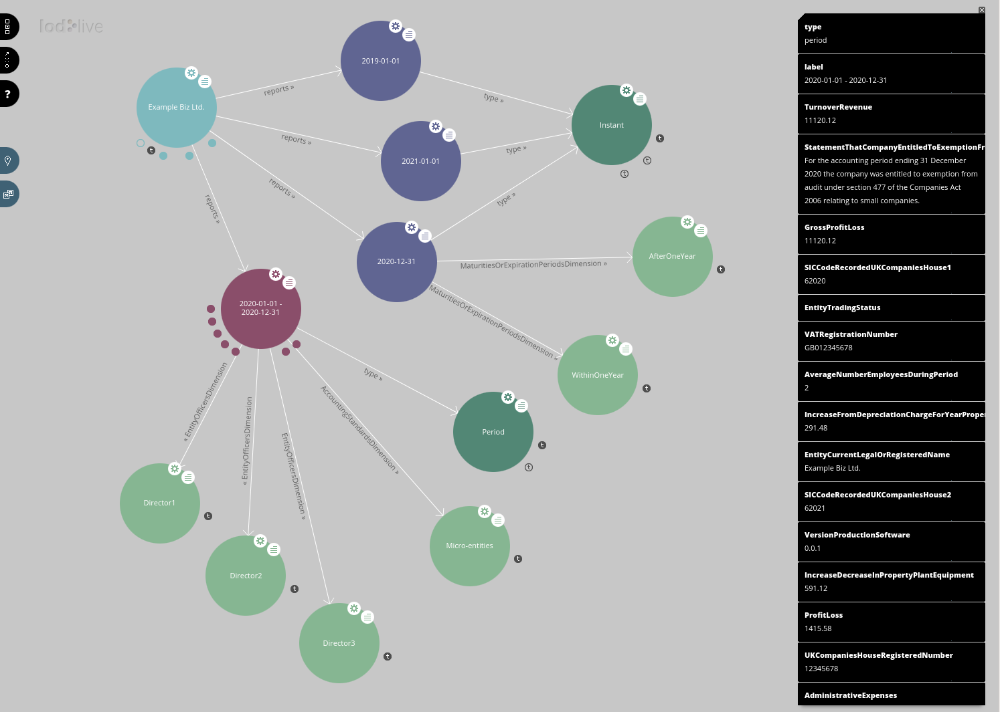

# `ixbrl-parse`

## Introduction

- Python library code, parses iXBRL files.
- Script `ixbrl-dump` emits iXBRL tagged data in a semi-human-readable dump.
- Script `ixbrl-report` emits iXBRL tagged data in a human-readable report.
  This involves downloading referenced XBRL schema to get the human-readable
  fact labels.
- Script `ixbrl-to-rdf` emits iXBRL tagged data in RDF.
- Script `ixbrl-to-csv` outputs iXBRL tagged data in a CSV format.
- Script `ixbrl-to-json` emits iXBRL tagged data in JSON.
- Script `ixbrl-to-xbrl` emits iXBRL tagged data as an XBRL instance.
- Script `ixbrl-to-kv` emits iXBRL in a key-value form easily consumed
  by scripts.
- Script `ixbrl-markdown` emits iXBRL tagged data in a markdown report.

## Sample data

There's a bunch of sample iXBRL files grabbed from various places in
the `ixbrl` directory: US 10-K and 10-Q filings, a few random things
from UK companies house, and a couple of sample ESEF filings.  This is the
data I've tested with.

Also, `accts.html` is a sample file created using
[`gnucash-ixbrl`](https://github.com/cybermaggedon/gnucash-ixbrl).

## Installation

```
pip3 install git+https://github.com/cybermaggedon/ixbrl-parse
```

## Usage

Parse iXBRL and output in RDF (default n3 format):
```
ixbrl-to-rdf accts.html
```

Parse iXBRL and output in RDF/XML:
```
ixbrl-to-rdf accts.html --format xml
```

Parse iXBRL and output in CSV:
```
ixbrl-to-csv accts.html
```

Parse iXBRL and output in JSON:
```
ixbrl-to-json accts.html
```

Schema labels in JSON:
```
ixbrl-to-json ixbrl/10k/lyft-20201231.htm -f labeled \
    -b https://www.sec.gov/Archives/edgar/data/1759509/000175950921000011/lyft-20201231.htm
```

Dump iXBRL values:
```
ixbrl-dump accts.html
```

Human-readable report:
```
ixbrl-report accts.html
```

Human-readable report from SEC EDGAR.  Note need to tell ixbrl-report the
URL of the original report in order to know where to fetch the
custom schema (relative URLs are used):

```
ixbrl-report ixbrl/10k/lyft-20201231.htm \
    -b https://www.sec.gov/Archives/edgar/data/1759509/000175950921000011/lyft-20201231.htm
```

Dump iXBRL as XBRL:
```
ixbrl-to-xbrl accts.html
```

## API

The `ixbrl-to-csv` file is a good starting point if you want to see how
the API works.

## What next?

This loads into a Redland RDF sqlite3 store:

```
ixbrl-to-rdf -i accts.html -f ntriples > accts.ntriples
rdfproc -n -s sqlite accts.db parse accts.ntriples ntriples
rdfproc -s sqlite accts.db print | head
```

I run a SPARQL store across the data, and view it with
[LodLive](https://github.com/LodLive/LodLive).



